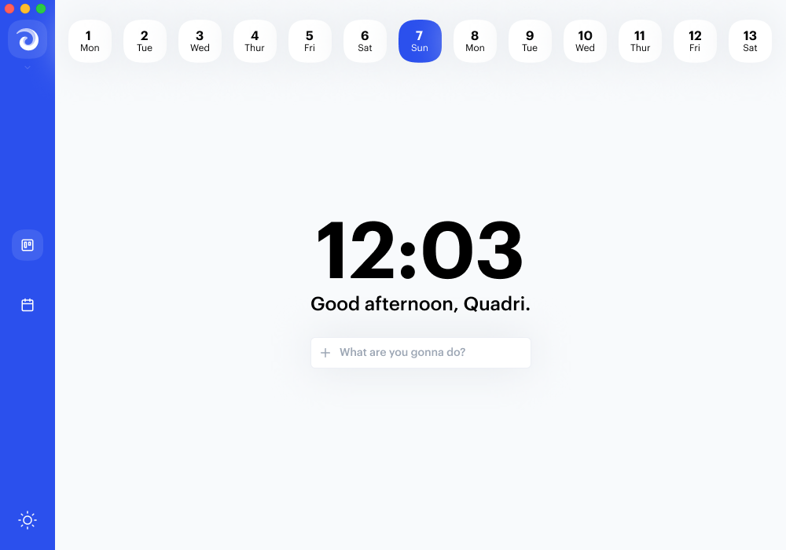

# Stopwatch

**A simple time logging application built with electron, typescript and react**

## Requirement

- `Node`: Any latest version of node above 8.9.0
- `Electron`: a node js port to build cross platform application
- `Typescript`: javascript that scales

## Resources for Learning Electron

- [electron.atom.io/docs](http://electron.atom.io/docs) - all of Electron's documentation
- [electron.atom.io/community/#boilerplates](http://electron.atom.io/community/#boilerplates) - sample starter apps created by the community
- [electron/electron-quick-start](https://github.com/electron/electron-quick-start) - a very basic starter Electron app
- [electron/simple-samples](https://github.com/electron/simple-samples) - small applications with ideas for taking them further
- [electron/electron-api-demos](https://github.com/electron/electron-api-demos) - an Electron app that teaches you how to use Electron
- [hokein/electron-sample-apps](https://github.com/hokein/electron-sample-apps) - small demo apps for the various Electron APIs

## How to set up the app and contribute to the project.

  * Read [Contribution](https://github.com/Quadriphobs1/stopwatch/blob/master/contribution.md)
